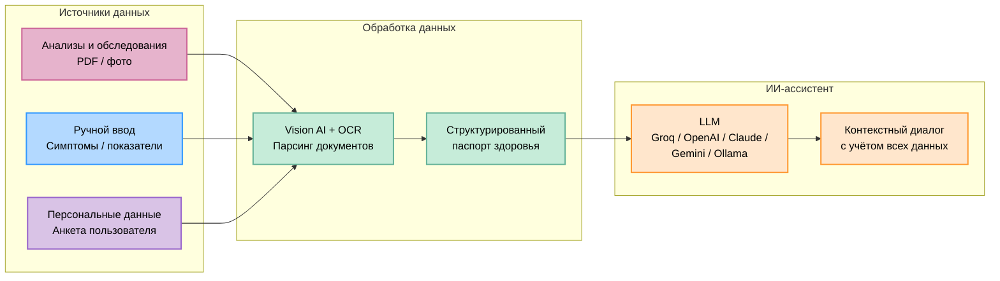

# Health Assistant

<div align="center">

**Цифровой пульт управления здоровьем | Команда Tehniki**

<p align="center">
  
  
  
  
  
</p>

</div>

---

## Что это такое

Health Assistant -- это веб-платформа, которая собирает медицинские данные пользователя в одном месте и даёт возможность общаться с ИИ-ассистентом, который эти данные понимает.

Простыми словами: пользователь загружает свои анализы, результаты обследований, описывает симптомы -- а система структурирует всё это и позволяет задавать вопросы умному ассистенту, который видит полную картину.

**Продукт не ставит диагнозы и не назначает лечение** -- он помогает пользователю осознанно управлять своим здоровьем и приходить к врачу подготовленным.

---

## Для кого этот продукт

- Люди, которые хотят держать свои медицинские данные в порядке
- Те, кто следит за динамикой показателей (анализы, вес, давление, сон)
- Пользователи, которым нужен удобный способ задать вопрос по своим данным без похода к врачу за каждой мелочью
- Компании, которые хотят дать сотрудникам инструмент заботы о здоровье

---

## Как это работает

```
Пользователь                  Система                         ИИ
    │                            │                              │
    ├── Загружает анализы ──────►│                              │
    │   (PDF, фото, ручной ввод) │                              │
    │                            ├── Парсинг и структуризация   │
    │                            │   данных                     │
    │                            ├── Формирование паспорта ─────┤
    │                            │   здоровья                   │
    ├── Задаёт вопрос ──────────►├── Контекст + вопрос ────────►│
    │                            │                              ├── Анализ
    │◄── Получает ответ ─────────┤◄── Ответ с учётом всех ──────┤
    │    с учётом СВОИХ данных   │    данных пользователя       │
```

---

## Ключевые возможности

### Паспорт здоровья
- Загрузка анализов и обследований (PDF, изображения)
- Автоматический парсинг через Vision AI + OCR
- Ручной ввод показателей и симптомов
- Хранение персональных данных (рост, вес, группа крови, пол, возраст)
- История всех загруженных данных

### ИИ-ассистент
- Диалог с учётом всех медицинских данных пользователя
- Поддержка нескольких LLM-провайдеров (Groq, OpenAI, Anthropic, Google, Ollama)
- Настраиваемые режимы ассистента с кастомными системными промптами
- Стриминг ответов в реальном времени
- Рендеринг Markdown, LaTeX-формул, таблиц

### Мультиязычность
- Русский язык по умолчанию
- Поддержка 10 языков интерфейса

### Безопасность
- Шифрование API-ключей (AES-256-CBC)
- Аутентификация пользователей
- Все данные хранятся локально, ничего не уходит на сторонние серверы
- Возможность полностью локального запуска (Ollama + Docling)

---

## Технологический стек

| Слой | Технологии |
|------|-----------|
| **Frontend** | Next.js 15, React 19, TypeScript, Tailwind CSS, Framer Motion |
| **Backend** | Next.js API Routes, Prisma ORM |
| **База данных** | PostgreSQL |
| **ИИ** | LangChain, OpenAI SDK, Anthropic SDK, Google GenAI |
| **Парсинг документов** | PDF.js, Vision AI (OpenAI, Google, Ollama), Docling, Upstage |
| **Аутентификация** | NextAuth.js |
| **Деплой** | Docker Compose |

---

## Архитектура




---

## Быстрый старт

### Требования
- Docker и Docker Compose
- Node.js 18+ (для локальной разработки)

### Установка и запуск

```bash
# Клонировать репозиторий
git clone https://github.com/guard22/health-assistant.git
cd health-assistant

# Скопировать конфигурацию
cp .env.example .env

# Запустить через Docker
docker compose --env-file .env up
```

Открыть в браузере: **http://localhost:3000**

### Локальная разработка

```bash
# Установить зависимости
npm install

# Запустить базу данных
docker compose up -d database

# Применить схему БД
npx prisma db push

# Запустить dev-сервер
npm run dev
```

---

## Поддерживаемые LLM-провайдеры

| Провайдер | Модели | Примечание |
|-----------|--------|-----------|
| **Groq** | openai/gpt-oss-120b, llama и др. | Быстрый инференс, OpenAI-совместимый API |
| **OpenAI** | GPT-4o, o3-mini и др. | Полная поддержка |
| **Anthropic** | Claude 3.5, 3.7 | Полная поддержка |
| **Google** | Gemini 2.0 Flash и др. | Полная поддержка |
| **Ollama** | Любые локальные модели | Полностью локальный запуск |

---

## Структура проекта

```
health-assistant/
├── src/
│   ├── app/                    # Next.js App Router
│   │   ├── api/                # API-эндпоинты
│   │   ├── chat/               # Экран чата
│   │   ├── login/              # Авторизация
│   │   ├── onboarding/         # Онбординг
│   │   └── source/             # Управление данными
│   ├── components/             # UI-компоненты
│   ├── lib/                    # Утилиты, парсеры, шифрование
│   └── i18n/                   # Интернационализация
├── prisma/                     # Схема БД и seed-данные
├── messages/                   # Файлы переводов (10 языков)
└── docker-compose.yaml         # Конфигурация Docker
```

---

## Лицензия

MIT

---

<div align="center">

**Разработано командой Tehniki**

</div>
